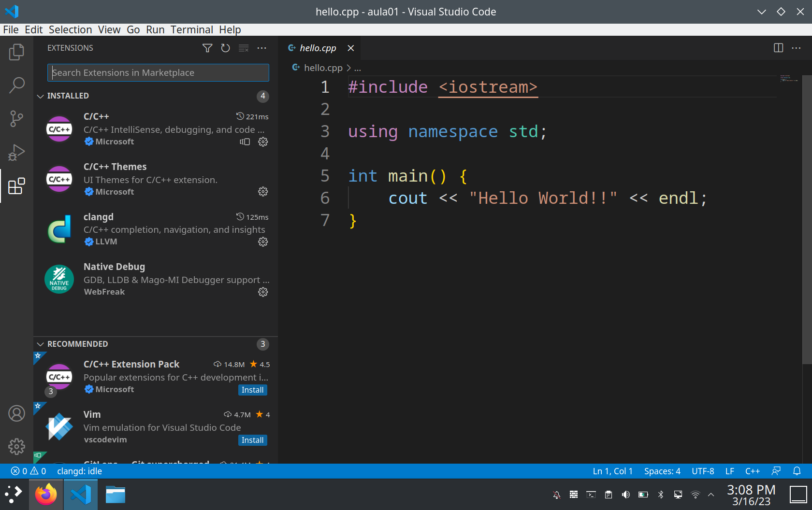

# Introdução ao WSL e/ou MinGW junto com o Visual Studio Code

{: .no_toc .mb-2 }
Como configurar o seu ambiente para a disciplina.
{: .fs-6 .fw-300 }

---
**Sumário**
1. TOC
{:toc}
---

## Informações básicas

O professor da disciplina vai usar um ambiente *Linux* nas aulas. Além do mais, o professor programa em [VSCode](https://code.visualstudio.com/). Se você usa Codeblocks, pare de usar. Ninguém usa no dia a dia.

A forma de se ter um ambiente mais próximo do professor no *Windows* é através do [Subsistema do Windows para Linux (Windows Subsystem for Linux -- **WSL**)](https://learn.microsoft.com/pt-br/windows/wsl/install). Siga o link anterior para aprender como instalar o WSL. Este outro [link](https://learn.microsoft.com/pt-br/windows/wsl/tutorials/wsl-vscode) explica como configurar o [VSCode](https://code.visualstudio.com/) para usar no WSL.

Alguns alunos preferem manter seu ambiente em [MinGW](https://www.mingw-w64.org/). Não tem nenhum problema com isso. De qualquer forma, o uso de compiladores mais modernos como o [Clang](https://clang.llvm.org/) é mais chatinho de configurar neste ambiente (eu acho, não sei, nunca fiz). Usar o MinGW não vai impactar sua vida na disciplina. Se você gosta, use e seja feliz.

Como a juventude, vocês, gostam de vídeos. Abaixo tem tudo em vídeos para ajudar no passo-a-passo.

## Já tenho WSL ou Ubuntu? Do que preciso.

Depois de instalar o WSL, execute os comandos abaixo no terminal Linux. O mesmo vale se você tiver Windows. Mas Flavio, você nem me disse como instalar o WSL ainda? Então, veja os vídeos abaixo e volte aqui. Coloquei isso antes para garantir que ninguém esqueça.

```
sudo apt update
sudo apt install build-essential git gdb cmake
```

## Vídeos de configuração WSL

Eu realmente acho que dá para fazer tudo com os links que já postei. Mas, se você quer ter uma experiência cinematográfica, isto é, ver vídeos, seguem alguns abaixo. Aviso que coloquei os vídeos que achei melhor ao passar o olho. A pessoinha que faz o vídeo em português, por exemplo, instalar um monte de coisa que não usamos na aula. Porém é didática. O em inglês é mais direto ao assunto.

### Vídeos em Português

O professor Thiago Noronha, criou uma ótima playlist mostrando o passo-a-passo. Podem seguir!

#### 1. Importância do ambiente de desenvolvimento e depuração de software 

<iframe width="560" height="315" src="https://www.youtube.com/embed/V4h8w47NIxQ" title="YouTube video player" frameborder="0" allow="accelerometer; autoplay; clipboard-write; encrypted-media; gyroscope; picture-in-picture" allowfullscreen></iframe>

#### 2. Instalação do WSL2 no Windows 10

<iframe width="560" height="315" src="https://www.youtube.com/embed/8-WZY4yIS54" title="YouTube video player" frameborder="0" allow="accelerometer; autoplay; clipboard-write; encrypted-media; gyroscope; picture-in-picture" allowfullscreen></iframe>

#### 3. Configuração e uso do WSL2 

<iframe width="560" height="315" src="https://www.youtube.com/embed/rMXu7gT9l_4" title="YouTube video player" frameborder="0" allow="accelerometer; autoplay; clipboard-write; encrypted-media; gyroscope; picture-in-picture" allowfullscreen></iframe>

#### 4. Instalando o VSCode

<iframe width="560" height="315" src="https://www.youtube.com/embed/mtLg-oYCZyY" title="YouTube video player" frameborder="0" allow="accelerometer; autoplay; clipboard-write; encrypted-media; gyroscope; picture-in-picture" allowfullscreen></iframe>

#### 5. Configurando o Code para C/C++

<iframe width="560" height="315" src="https://www.youtube.com/embed/y6dbYunHnpM" title="YouTube video player" frameborder="0" allow="accelerometer; autoplay; clipboard-write; encrypted-media; gyroscope; picture-in-picture" allowfullscreen></iframe>


### (Inglês) Rapidinho

<iframe width="560" height="315" src="https://www.youtube.com/embed/Hwbii-fnKIk" title="YouTube video player" frameborder="0" allow="accelerometer; autoplay; clipboard-write; encrypted-media; gyroscope; picture-in-picture" allowfullscreen></iframe>

## Vídeos de configuração MinGW

Caso queira manter o MinGW (de boa), segue alguns dados para voc

### (PT-BR) Veja o vídeo abaixo para configurar seu ambiente

<iframe width="560" height="315" src="https://www.youtube.com/embed/OKzFhpEQcyY" title="YouTube video player" frameborder="0" allow="accelerometer; autoplay; clipboard-write; encrypted-media; gyroscope; picture-in-picture" allowfullscreen></iframe>

### O link abaixo também tem informações parecidas

[Instalando o VSCode](http://cfbcursos.com.br/instalando-e-configurando-o-vs-code-com-mingw/)

## Extensões Utilizadas pelo Professor

Abaixo tem uma imagem com as extensões que recomendo. As mesmas devem funcionar tanto no Windows quanto no Linux. Caso não tenha o compilador `clang`, pode ignorar a extensão `clangd`. A extensão C/C++ da Microsoft cumpre um propósito similar, então o uso das duas é até redundante. Não se preocupe se a `clang` não for instalada.


